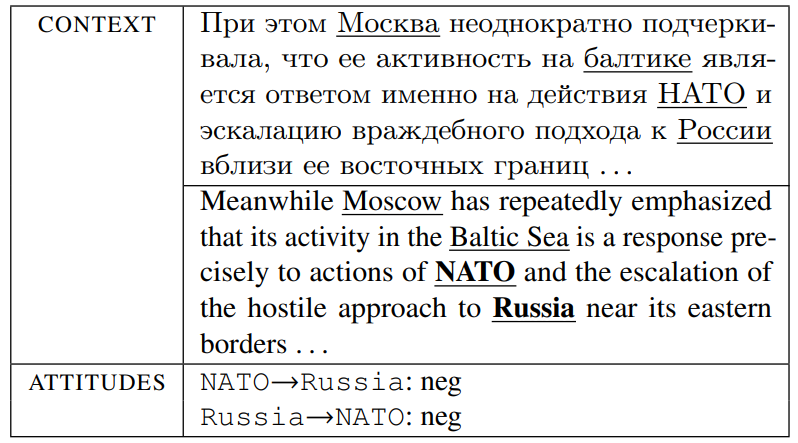

## Neural Networks Applications in Sentiment Attitude Extraction 

**Version**: 0.21.0

This repository is an application for neural-networks of AREkit framework, devoted 
to sentiment **attitude extraction** task [[initial-paper]](https://arxiv.org/pdf/1808.08932.pdf), applied for a document **contexts**:


> Figure: Example of a context with attitudes mentioned in
it; named entities **«Russia»** and **«NATO»** have the negative attitude towards each other with additional indication of other
named entities.

It provides applications for:
* [Data serialization](#application-1-data-serialization);
* [Training neural networks](#application-2-training) for the following [models list](#models-list).

## Models List

* **Aspect-based Attentive encoders**:
    - Multilayer Perceptron (MLP)
        [[code]](https://github.com/nicolay-r/AREkit/tree/0.21.0-rc/contrib/networks/attention/architectures/mlp.py) /
        [[github:nicolay-r]](https://github.com/nicolay-r/mlp-attention);
* **Self-based Attentive encoders**:
    - P. Zhou et. al.
        [[code]](https://github.com/nicolay-r/AREkit/tree/0.21.0-rc/contrib/networks/attention/architectures/self_p_zhou.py) /
        [[github:SeoSangwoo]](https://github.com/SeoSangwoo/Attention-Based-BiLSTM-relation-extraction);
    - Z. Yang et. al.
        [[code]](https://github.com/nicolay-r/AREkit/tree/0.21.0-rc/contrib/networks/attention/architectures/self_z_yang.py) /
        [[github:ilivans]](https://github.com/ilivans/tf-rnn-attention);
* **Single Sentence Based Architectures**:
    - CNN
        [[code]](https://github.com/nicolay-r/AREkit/tree/0.21.0-rc/contrib/networks/context/architectures/cnn.py) /
        [[github:roomylee]](https://github.com/roomylee/cnn-relation-extraction);
    - CNN + Aspect-based MLP Attention
        [[code]](https://github.com/nicolay-r/AREkit/tree/0.21.0-rc/contrib/networks/context/architectures/base/att_cnn_base.py);
    - PCNN
        [[code]](https://github.com/nicolay-r/AREkit/tree/0.21.0-rc/contrib/networks/context/architectures/pcnn.py) /
        [[github:nicolay-r]](https://github.com/nicolay-r/sentiment-pcnn);
    - PCNN + Aspect-based MLP Attention
        [[code]](https://github.com/nicolay-r/AREkit/tree/0.21.0-rc/contrib/networks/context/architectures/base/att_pcnn_base.py);
    - RNN (LSTM/GRU/RNN)
        [[code]](https://github.com/nicolay-r/AREkit/tree/0.21.0-rc/contrib/networks/context/architectures/rnn.py) /
        [[github:roomylee]](https://github.com/roomylee/rnn-text-classification-tf);
    - IAN (frames based)
        [[code]](https://github.com/nicolay-r/AREkit/tree/0.21.0-rc/contrib/networks/context/architectures/ian_frames.py) /
        [[github:lpq29743]](https://github.com/lpq29743/IAN);
    - RCNN (BiLSTM + CNN)
        [[code]](https://github.com/nicolay-r/AREkit/tree/0.21.0-rc/contrib/networks/context/architectures/rcnn.py) /
        [[github:roomylee]](https://github.com/roomylee/rcnn-text-classification);
    - RCNN + Self Attention
        [[code]](https://github.com/nicolay-r/AREkit/tree/0.21.0-rc/contrib/networks/context/architectures/rcnn_self.py);
    - BiLSTM
        [[code]](https://github.com/nicolay-r/AREkit/tree/0.21.0-rc/contrib/networks/context/architectures/bilstm.py) /
        [[github:roomylee]](https://github.com/roomylee/rnn-text-classification-tf);
    - Bi-LSTM + Aspect-based MLP Attention 
        [[code]](https://github.com/nicolay-r/AREkit/tree/0.21.0-rc/contrib/networks/context/architectures/base/att_bilstm_base.py)
    - Bi-LSTM + Self Attention
        [[code]](https://github.com/nicolay-r/AREkit/tree/0.21.0-rc/contrib/networks/context/architectures/self_att_bilstm.py) /
        [[github:roomylee]](https://github.com/roomylee/self-attentive-emb-tf);
    - RCNN + Self Attention
        [[code]](https://github.com/nicolay-r/AREkit/tree/0.21.0-rc/contrib/networks/context/architectures/att_self_rcnn.py);
* **Multi Sentence Based Encoders Architectures**:
    - Self Attentive 
        [[code]](https://github.com/nicolay-r/AREkit/tree/0.21.0-rc/contrib/networks/multi/architectures/att_self.py);
    - Max Pooling
        [[code]](https://github.com/nicolay-r/AREkit/tree/0.21.0-rc/contrib/networks/multi/architectures/max_pooling.py) /
        [[paper]](https://pdfs.semanticscholar.org/8731/369a707046f3f8dd463d1fd107de31d40a24.pdf);
    - Single MLP
        [[code]](https://github.com/nicolay-r/AREkit/tree/0.21.0-rc/contrib/networks/multi/architectures/base/base_single_mlp.py);

## Dependencies

* AREKit == 0.21.0

## Installation

```shell script
# Clone repository in local folder of the currect project. 
git clone -b 0.21.0-rc git@github.com:nicolay-r/AREkit.git arekit
# Install dependencies.
pip install -r arekit/requirements.txt
```

### Prepare the data

We utilize RusVectores `news-2015` embedding:
```shell script
mkdir -p data
curl http://rusvectores.org/static/models/rusvectores2/news_mystem_skipgram_1000_20_2015.bin.gz -o "data/news_rusvectores2.bin.gz"
```

## Application #1. Data Serialization

Using `run_serialization.sh` in order to prepare data for a particular experiment:

```shell script
python run_serialization.py 
    --cv-count 3 --frames-version v2_0 
    --experiment rsr+ra --labels-count 3 --ra-ver v1_0
    --emb-filepath data/news_rusvectores2.bin.gz 
    --entity-fmt rus-simple --balance-samples True
```

## Application #2. Training

Using `run_train_classifier.sh` to run an experiment.

```shell script
CUDA_VISIBLE_DEVICES=0 python run_training.py --do-eval 
    --bags-per-minibatch 32 --dropout-keep-prob 0.80 --cv-count 3 
    --labels-count 3 --experiment rsr+ra --model-input-type ctx --ra-ver v1_0
    --model-name cnn --test-every-k-epoch 5 --learning-rate 0.1 
    --balanced-input True --train-acc-limit 0.99  --epochs 100
```

## Script Arguments Manual

Common flags:
* `--experiment` -- is an experiment which could be as follows:
    * `rsr` -- supervised learning + evaluation within [RuSentRel](https://github.com/nicolay-r/RuSentRel) collection;
    * `ra` -- pretraining with [RuAttitudes](https://github.com/nicolay-r/RuAttitudes) collection;
    * `rsr+ra` -- combined training within RuSentRel and RuAttitudes and evalut.
* `--cv_count` -- data folding mode:
    * `1` -- predefined docs separation onto TRAIN/TEST (RuSentRel);
    * `k` -- CV-based folding onto `k`-folds; (`k=3` supported);
* `--frames_versions` -- RuSentiFrames collection version:
    * `v2.0` -- RuSentiFrames-2.0;
* `--ra_ver` -- RuAttitudes version, if collection is applicable (`ra` or `rsr+ra` experiments):
    * `v1_2` -- RuAttitudes-1.0 [paper](https://www.aclweb.org/anthology/R19-1118/);
    * `v2_0_base`;
    * `v2_0_large`;
    * `v2_0_base_neut`;
    * `v2_0_large_neut`;
    
Training specific flags:
* `--model_name` -- model to train (see [[list]](#models-list));
* `--do_eval` -- activates evaluation during training process;
* `--bags_per_minibatch` -- количество мешков в мини-партии;
* `--balanced_input` -- флаг, указывает на использование сбалансированной коллекции в обучении модели;
* `--emb-filepath` -- path to Word2Vec model;
* `--entity-fmt` -- entities formatting type:
    * `rus-simple`  -- using russian masks: `объект`, `субъект`, `сущость`;
    * `sharp-simple` -- using BERT related notation for meta tokens: `#O` (object), `#S` (subjects), `#E` (entities);
* `--balance-samples` -- activates sample balancing;
